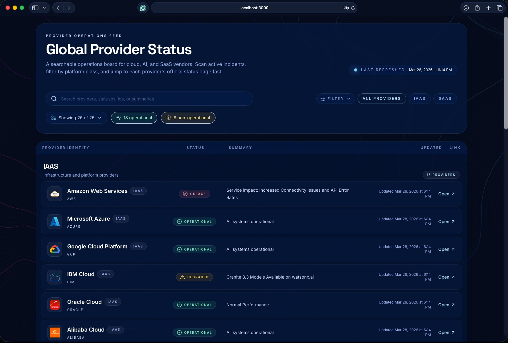

# Cloud Status Dashboard

A dashboard that pulls together status updates from 27 cloud providers into one place. Everything shows up on a single dashboard, refreshed every 5 minutes.

The app fetches provider status server-side, normalizes different data formats into a shared model, and renders them in a clean responsive UI. Browsers only ever call your own deployment, never provider endpoints directly (to do not be throttled/banned from the provider api for overuse).

## Supported Providers

IAAS: AWS, Microsoft Azure, Google Cloud Platform, IBM Cloud, Oracle Cloud, Alibaba Cloud, DigitalOcean, Cloudflare, OVHcloud, Vultr, Linode, Akamai, Vercel, Heroku, MongoDB Cloud, UpCloud

SAAS: GitHub, GitLab, Atlassian, Datadog, Twilio, Slack, Splunk Cloud Platform, Salesforce, Claude, Gemini, OpenAI

## Screenshot

The dashboard displays providers in two sections (IAAS and SAAS) with color-coded status cards.





## Getting Started

Run the development server:

```bash
npm run dev
```

Open http://localhost:3000 in your browser.

## Production Build

```bash
npm run build
npm run start
```

## Docker

### Ready image

https://hub.docker.com/repository/docker/dmitryporotnikov/status-dashboard

### Build yourself

The project includes a multi-stage Dockerfile and standalone Next.js config.

Build the image:

```bash
docker build -t status-dashboard:latest .
```

Run it:

```bash
docker run --rm -p 3000:3000 --name status-dashboard status-dashboard:latest
```

Then open http://localhost:3000.

## Push to Docker Hub

1. Create a Docker Hub repository named `YOUR_DOCKERHUB_USERNAME/status-dashboard`.

2. Log in:

```bash
docker login
```

3. Build and tag:

```bash
docker build -t YOUR_DOCKERHUB_USERNAME/status-dashboard:latest .
docker tag YOUR_DOCKERHUB_USERNAME/status-dashboard:latest YOUR_DOCKERHUB_USERNAME/status-dashboard:0.1.0
```

4. Push:

```bash
docker push YOUR_DOCKERHUB_USERNAME/status-dashboard:latest
docker push YOUR_DOCKERHUB_USERNAME/status-dashboard:0.1.0
```

5. Pull and run anywhere:

```bash
docker pull YOUR_DOCKERHUB_USERNAME/status-dashboard:latest
docker run --rm -p 3000:3000 YOUR_DOCKERHUB_USERNAME/status-dashboard:latest
```
